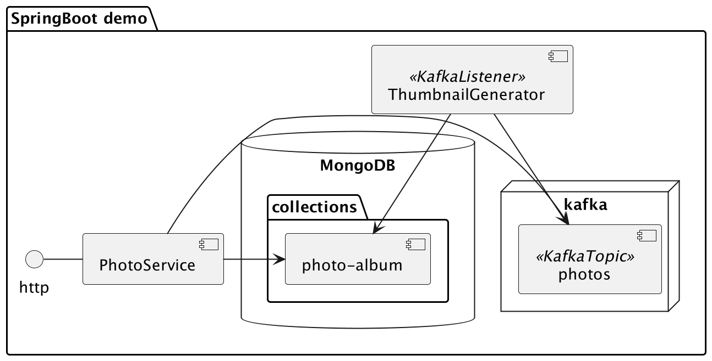

# SpringBoot Demo

## Overview

## Components

The demo consists of two SpringBoot components:

### photo-service:
A REST microservice using Spring Reactive Web that supports the following functionality:
* Uploading a photo: POST /photo  
  The uploaded photo is stored in mongo GridFS and a record of the photo is stored in mongo photos collection. The photo record includes the following fields:
  * id: primary key.
  * dimension: the width and height of the photo.
  * size: the size of the photo file in bytes.
  * thumbnail: the id of the photo thumbnail stored as another photo record.
  
* Downloading a photo using the photo id: GET /photo/{id}/data
* Listing all photos: GET /photos

### thumbnail-generator:
A kafka listener that generates the photo thumbnail. The thumbnail is stored in the photos collection as an ordinary photo.  
Messages in kafka that the listener processes are generated during photo upload by the photo-service.
